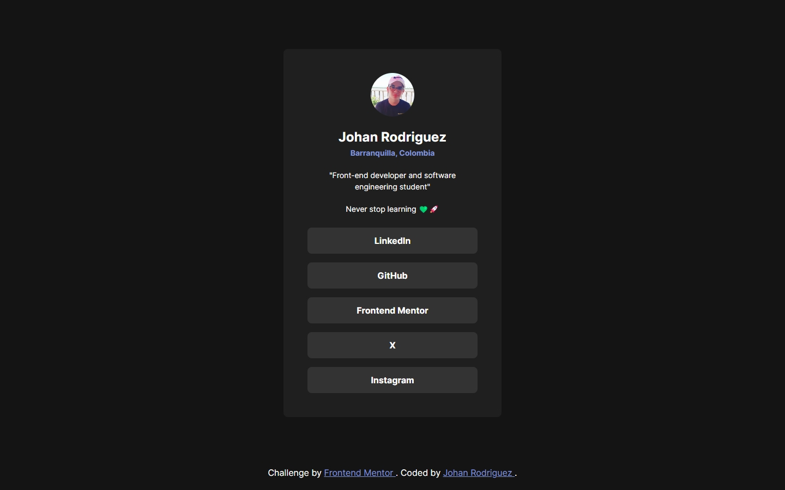

# Frontend Mentor - Social links profile solution

This is a solution to the [Social links profile challenge on Frontend Mentor](https://www.frontendmentor.io/challenges/social-links-profile-UG32l9m6dQ). Frontend Mentor challenges help you improve your coding skills by building realistic projects.

## Table of contents

- [Frontend Mentor - Social links profile solution](#frontend-mentor---social-links-profile-solution)
  - [Overview](#overview)
    - [The challenge](#the-challenge)
    - [Screenshot](#screenshot)
    - [Links](#links)
  - [My process](#my-process)
    - [Built with](#built-with)
    - [What I learned](#what-i-learned)
    - [Useful resources](#useful-resources)
  - [Author](#author)

## Overview

### The challenge

Users should be able to:

- See hover and focus states for all interactive elements on the page

### Screenshot



### Links

- [Solution URL](https://www.frontendmentor.io/solutions/responsive-social-links-profile-using-css-functions-ipo8qqe54I)
- [Live Site URL](https://jdrodriguez2707.github.io/social-links-profile/)

## My process

### Built with

- Semantic HTML5 markup
- CSS custom properties
- Flexbox
- CSS Grid
- Mobile-first workflow
- [Google fonts](https://fonts.google.com/) - Font library

### What I learned

I learned that anchors allow users to select them by pressing the tab key by default and that the `:focus` pseudo-class can be used to style the anchor when it is selected. I also learned the property `outline-offset` which allows you to adjust the space between the outline and the element. I used this property to style the button when it is selected with the tab key for improved accessibility.

```css
&:focus {
  outline: 2px solid var(--tertiary-color);
  outline-offset: 4px;
}
```

### Useful resources

- [Nu HTML Checker](https://validator.w3.org/nu/) - This helped me to validate my HTML code and make sure it was correct with the W3C standards.
- [Tailwind CSS Color Generator](https://uicolors.app/create) - This helped me to generate the color palette for the project.

## Author

- Frontend Mentor - [@jdrodriguez2707](https://www.frontendmentor.io/profile/jdrodriguez2707)
- X - [@Johan79854000](https://twitter.com/Johan79854000)
- LinkedIn - [Johan Rodriguez](https://www.linkedin.com/in/jdrodriguez2707/)
- Instagram - [@johan_rodriguez_dev](https://www.instagram.com/johan_rodriguez_dev)
